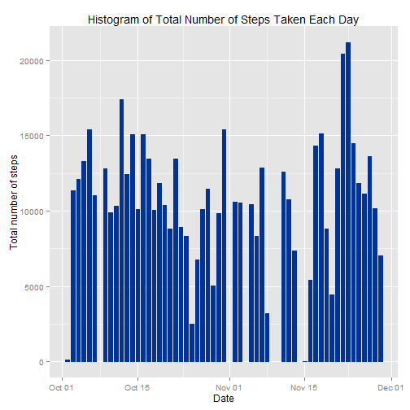
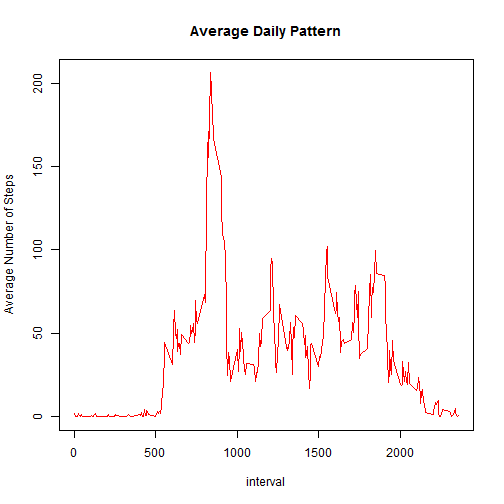
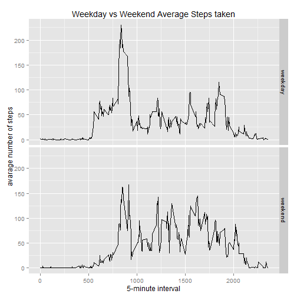

<H1>Reproducible Research:Peer Assessment 1</H1>

It is assumed that the data to be analysed is already in the Directory.</br>
Packages Used in the analysis:

```r
library(knitr)
library(ggplot2)
library(dplyr)
```

<H2>Loading and preprocessing the data:</H2>
The orignal data is transformed into data_needed which will be needed for further analysis.


```r
unzip("activity.zip")
data=read.csv("activity.csv")
data$date=as.Date(data$date, format = "%Y-%m-%d")
data_needed=data[!(is.na(data$steps)),]
rownames(data_needed)=1:nrow(data_needed)
head(data_needed)
```

```
##   steps       date interval
## 1     0 2012-10-02        0
## 2     0 2012-10-02        5
## 3     0 2012-10-02       10
## 4     0 2012-10-02       15
## 5     0 2012-10-02       20
## 6     0 2012-10-02       25
```

```r
tail(data_needed)
```

```
##       steps       date interval
## 15259     0 2012-11-29     2330
## 15260     0 2012-11-29     2335
## 15261     0 2012-11-29     2340
## 15262     0 2012-11-29     2345
## 15263     0 2012-11-29     2350
## 15264     0 2012-11-29     2355
```

<H2>What is mean total number of steps taken per day?</H2>
The data is grouped together by date.

```r
data_group_date=group_by(data_needed,date)
ggplot(data_group_date, aes(date, steps)) + geom_bar(stat = "identity", colour = "#003399", fill = "#003399", width = 0.7) +  labs(title = "Histogram of Total Number of Steps Taken Each Day", x = "Date", y = "Total number of steps")
```

 

```r
summarise(data_group_date, mean(steps),median(steps))
```

```
## Source: local data frame [53 x 3]
## 
##          date mean(steps) median(steps)
## 1  2012-10-02     0.43750             0
## 2  2012-10-03    39.41667             0
## 3  2012-10-04    42.06944             0
## 4  2012-10-05    46.15972             0
## 5  2012-10-06    53.54167             0
## 6  2012-10-07    38.24653             0
## 7  2012-10-09    44.48264             0
## 8  2012-10-10    34.37500             0
## 9  2012-10-11    35.77778             0
## 10 2012-10-12    60.35417             0
## ..        ...         ...           ...
```

<H2>What is the average daily activity pattern?</H2>
The data is now grouped by intervals.

```r
data_group_interval=group_by(data_needed,interval)
hist_data_interval=summarise(data_group_interval,mean(steps))
plot(hist_data_interval,type='l',ylab="Average Number of Steps",main="Average Daily Pattern",col="red")
```

 


</br>The 5 minute interval which contains the maximum steps is <b>835</b>

<H2>Imputing missing values</H2>

The number of missing values are <b>2304</b></br>
Now we are going to fill the intervals which have missing values by their interval means calculated over all the days.

```r
newData = data 
for (i in 1:nrow(newData)) {
  if (is.na(newData$steps[i])) {
    newData$steps[i] = hist_data_interval[which(newData$interval[i] == hist_data_interval$interval), ]$steps_mean
  }
}
```
</br>Now we will make a histogram.

```r
newdata_group_date=group_by(newData,date)
ggplot(newdata_group_date, aes(date, steps)) + geom_bar(stat = "identity", colour = "#003399", fill = "#003399", width = 0.7) +  labs(title = "Histogram of Total Number of Steps Taken Each Day", x = "Date", y = "Total number of steps")
```

 
</br>
Let us have a look at the mean and median.

```
## Source: local data frame [61 x 3]
## 
##          date mean(steps) median(steps)
## 1  2012-10-01    37.38260      34.11321
## 2  2012-10-02     0.43750       0.00000
## 3  2012-10-03    39.41667       0.00000
## 4  2012-10-04    42.06944       0.00000
## 5  2012-10-05    46.15972       0.00000
## 6  2012-10-06    53.54167       0.00000
## 7  2012-10-07    38.24653       0.00000
## 8  2012-10-08    37.38260      34.11321
## 9  2012-10-09    44.48264       0.00000
## 10 2012-10-10    34.37500       0.00000
## ..        ...         ...           ...
```
We see that that mean and median remains the same for previous entries but both increase for the new values added.

<H2>Are there differences in activity patterns between weekdays and weekends?</H2>
Function for calculating weekday or weekend.

```r
newData$typedate=ifelse(as.POSIXlt(newData$date)$wday %in% c(0,6), 'weekend', 'weekday')
```
Now let us make a panel plot of 5 minute intervals for weekdays and weekends.


```r
averageddata <- aggregate(steps ~ interval + typedate, data=newData, mean)
ggplot(averageddata, aes(interval, steps)) +   geom_line() +   facet_grid(typedate ~ .)  +labs(title="Weekday vs Weekend Average Steps taken",y="avarage number of steps",x="5-minute interval")
```

 
